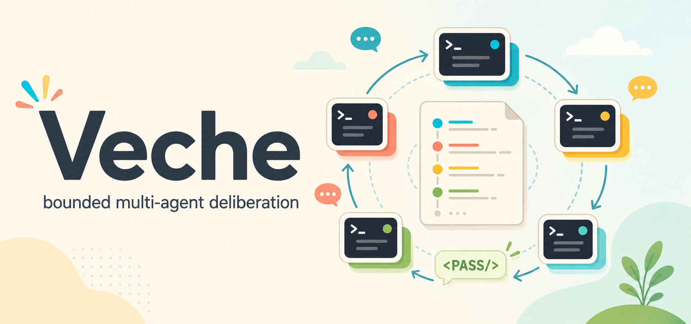

# Veche

> Вече — bounded multi-agent deliberation as an MCP server.

`veche` is a Model Context Protocol (MCP) server that lets an orchestrator agent (Claude
Code, a custom agent, your IDE) convene **committee meetings** between LLM agents and read
back a structured transcript. The protocol is self-extinguishing: every member replies in
rounds, anyone can opt out with the literal token `<PASS/>`, and the meeting terminates the
moment everyone passes in the same round (or hits `max_rounds`).

The name comes from the medieval Slavic *вече* — a popular assembly that deliberated by
acclamation and dispersed when the matter was settled. That maps almost directly onto
`rounds + <PASS/> until silence`.

v1 ships two symmetric CLI-backed adapters:

- **Codex** via `codex exec` (OpenAI)
- **Claude Code** via `claude -p` (Anthropic) — with a recursion guard that prevents a child
  Claude Code from re-entering this same server

The orchestrator may itself be Claude Code, enabling
`Claude Code ↔ another Claude Code + Codex` committees. Architecture and behaviour are
fully specified in [`spec/`](spec/) using a C4-inspired four-level model; code follows the
spec and changes are made to the spec first.

---

## Why

LLMs collapse into a single line of reasoning on hard problems. A standing MCP tool for
pulling a second opinion from a different model — or a differently-prompted instance of the
same model — broadens the search, surfaces blind spots, and produces more balanced
decisions. The committee protocol drives the discussion to a stable point without the
orchestrator hand-rolling turn-taking.

## Install

```bash
npm install -g veche
veche install        # writes SKILL.md to ~/.claude/skills/veche/ and ~/.codex/skills/veche/
                     # plus claude mcp add / codex mcp add for the stdio MCP server
```

Restart your Claude Code / Codex session after installing. The skill is invoked as
`/veche <question>`.

If you cloned the repo:

```bash
npm install
npm run build
node dist/bin/veche.js install
```

### Prerequisites

| | Required for |
|---|---|
| Node.js ≥ 20.11 | running the server |
| `codex` on `PATH` | Codex participants |
| `claude` on `PATH` | Claude Code participants and as an MCP host |
| `CODEX_API_KEY` **or** `codex login` | Codex auth (either path works) |
| `claude login` | Claude Code auth |

## Quick start

### As a Claude Code skill

After `veche install`, open Claude Code and type:

```
/veche should we use argparse or click for a new Python CLI?
```

The skill drives the full lifecycle: `start_meeting` → `send_message` →
poll `get_response` until the Job terminates → `end_meeting` → render the transcript
grouped by member with a synthesis paragraph.

Pass `ROUNDS=N` (1..16) before the question to override the default 3-round budget.

### As a generic MCP server

`veche install` registers the server under both Claude Code and Codex. To wire it into a
different MCP host, use whichever invocation that host supports — the binary is just
stdio. A representative `mcp.json` snippet:

```json
{
  "mcpServers": {
    "veche": {
      "command": "node",
      "args": ["/abs/path/to/dist/bin/veche-server.js"],
      "env": { "VECHE_LOG_LEVEL": "info" }
    }
  }
}
```

### Programmatic embedding (Node)

```ts
import { bootstrap } from 'veche';

const { mcp, shutdown } = await bootstrap();
await mcp.connect(); // stdio — point an MCP client at the process
// ...
await shutdown();
```

## Committee protocol

One `send_message` = one `Job`. Each Job executes up to `maxRounds` (default 8, capped by
`VECHE_MAX_ROUNDS_CAP`, default 16) rounds:

1. **Round 0** — the facilitator's message is appended to the transcript.
2. **Round N (N ≥ 1)** — every active member is dispatched in parallel. Each member sees
   every other member's prior messages since its own last turn. A member replies with
   either new substantive content (`speech`) or the literal token `<PASS/>` (`pass`) to opt
   out of the current round.
3. The discussion terminates when:
   - every active member emits `<PASS/>` in the same round → `all-passed`
   - `roundNumber >= maxRounds` → `max-rounds`
   - all members dropped out → `no-active-members`
   - an external `cancel_job` fired → `cancelled`

If a member's adapter fails irrecoverably, that member is **dropped** and the discussion
continues. The drop is recorded in the transcript as a `system` message so remaining
members can acknowledge the missing voice.

Full rules:
[`spec/features/committee-protocol/`](spec/features/committee-protocol/committee-protocol.md).

## MCP tool surface

| Tool | Purpose |
|------|---------|
| `start_meeting` | Create a Meeting. Opens an adapter Session per member. |
| `send_message` | Post a facilitator message; returns `jobId` + `cursor`. Non-blocking. |
| `get_response` | Poll a Job: status + transcript delta since a cursor. Supports `waitMs`. |
| `list_meetings` | Enumerate meetings. Filter by status / time range. |
| `get_transcript` | Read a transcript outside of a Job-polling loop. |
| `end_meeting` | Close a meeting. `cancelRunningJob` terminates an in-flight Job first. |
| `cancel_job` | Abort a running Job. Graceful first (30s), forced after. |

Schemas and per-tool behaviour:
[`spec/features/meeting/*.usecase.md`](spec/features/meeting/).

## CLI: `veche`

`veche` is a separate read-only binary that reads `$VECHE_HOME` directly via `FileMeetingStore`.
It can run alongside the MCP server safely — both processes share the same data.

```bash
veche list                           # active meetings (default)
veche list --status all --limit 20   # widen the filter
veche list --format json | jq .

veche show <meetingId>                          # text + ANSI on a TTY
veche show <meetingId> --format markdown
veche show <meetingId> --format json > transcript.json
veche show <meetingId> --format html --out report.html
veche show <meetingId> --format html --open     # tmp file + browser
veche show <meetingId> --raw                    # include round.* and job.* events
veche show <meetingId> --home /alt/store        # override $VECHE_HOME

veche watch                          # local web viewer (live SPA + SSE)
veche watch --port 7654 --no-open    # explicit port, skip auto-open

veche install                        # register skill + MCP server (both hosts)
veche install --for=claude-code      # only one host
veche install --dry-run              # print actions without performing them
```

The **HTML report** (`show --format html`) is a single self-contained file (no remote
assets, no `<script>`, no `<link rel="stylesheet">`) with a chat-bubble layout per round
and colors derived deterministically from `participantId`.

The **live web viewer** (`watch`) starts a loopback HTTP server with a single-page app and
two Server-Sent Events channels: one for the meeting list (sidebar updates as new meetings
appear / change status), one per selected meeting (transcript updates as messages are
appended). Cross-process safe — the watch server polls the on-disk store at 750 ms cadence,
so MCP-server-driven updates surface within ~1 s without restarting anything. Speech
bubbles render the same Markdown subset as `show --format html`.

Exit codes: `0` ok · `2` store unavailable / write failed · `3` meeting not found ·
`64` usage error · `1` unhandled internal error.

Full CLI specs:
[`show-meeting-cli`](spec/features/meeting/show-meeting-cli.usecase.md),
[`list-meetings-cli`](spec/features/meeting/list-meetings-cli.usecase.md),
[`watch-server`](spec/features/web-viewer/watch-server.usecase.md),
[`install-cli`](spec/features/install/install-cli.usecase.md).

## Configuration

### Environment

| Variable | Default | Purpose |
|----------|---------|---------|
| `VECHE_HOME` | `~/.veche` | Root for `FileStore` data and the user config. |
| `VECHE_STORE` | `file` | `file` or `memory`. |
| `VECHE_LOG_LEVEL` | `info` | `trace`/`debug`/`info`/`warn`/`error`. |
| `VECHE_MAX_ROUNDS_CAP` | `16` | Hard clamp for `max_rounds`. |
| `VECHE_E2E` | — | Set to `1` to enable opt-in real-CLI E2E tests. |
| `CODEX_API_KEY` | — | Optional; Codex also reads `~/.codex/auth.json`. |
| `CODEX_BIN` | `codex` | Override the Codex binary. |
| `CLAUDE_BIN` | `claude` | Override the Claude Code binary. |

### Profiles

Named participant profiles live in `$VECHE_HOME/config.json`
(see [`examples/config.json.example`](examples/config.json.example)):

```json
{
  "version": 1,
  "profiles": [
    {
      "name": "codex-senior",
      "adapter": "codex-cli",
      "model": "gpt-5-codex",
      "systemPrompt": "You are a senior engineer. Give concise opinions.",
      "workdir": null,
      "extraFlags": ["--skip-git-repo-check"],
      "env": {}
    }
  ]
}
```

`start_meeting.members[]` accepts either `{ profile: "codex-senior" }` or ad-hoc overrides.

### Recursion guard (Claude Code)

Every `claude -p` invocation is launched with
`--strict-mcp-config --mcp-config '{"mcpServers":{}}'` plus
`--disallowedTools=Bash,Edit,Write,NotebookEdit` by default. The child Claude Code cannot
inherit the parent's MCP configuration, so it cannot re-enter this server and spawn more
children. Participants that need extended isolation can add `--bare` via `extraFlags`
(which additionally requires `ANTHROPIC_API_KEY`).

## Architecture

Hexagonal + Vertical Slices. Every feature lives under `src/features/<feature>/` with its
own `domain/`, `application/`, `ports/`, and (for features that own ports) `adapters/`.

```
src/
├── features/
│   ├── meeting/                 # 7 MCP tools, domain entities, JobRunner
│   ├── committee-protocol/      # round algorithm, pass signal, terminate/drop
│   ├── agent-integration/       # AgentAdapterPort + codex-cli, claude-code-cli, fake
│   └── persistence/             # MeetingStorePort + in-memory, file (JSONL)
├── adapters/inbound/
│   ├── mcp/                     # MCP server (stdio), tool registration, zod schemas
│   ├── cli/                     # veche CLI (list, show, watch, install) + renderers
│   └── web/                     # watch server: HTTP, SSE, SPA
├── shared/markdown/             # escape-then-transform Markdown converter (used by html + watch)
├── infra/                       # DI composition root, StructuredLogger, SystemClock, UuidIdGen
├── shared/                      # branded ids, DomainError, Clock/IdGen/Logger ports
└── bin/
    ├── veche-server.ts          # stdio MCP entrypoint
    └── veche.ts                 # human-operator CLI entrypoint
```

Full specification: [`spec/system.md`](spec/system.md) → containers/features/use cases.

## Development

```bash
npm run typecheck      # strict tsc across src/
npm run lint           # biome check
npm run lint:fix       # biome check --write
npm test               # vitest — unit + MCP stdio smoke + web SSE integration
npm run build          # emit dist/
```

### End-to-end against real CLIs (opt-in)

Gated on `VECHE_E2E=1` to avoid token spend on normal runs:

```bash
VECHE_E2E=1 npx vitest run src/e2e/claude-code.e2e.test.ts   # ~4s
VECHE_E2E=1 npx vitest run src/e2e/codex.e2e.test.ts         # ~6s
VECHE_E2E=1 npx vitest run src/e2e/committee.e2e.test.ts     # ~25s
```

The committee test runs a real 3-round discussion between `codex exec` and `claude -p`
through the full pipeline (`start_meeting` → `send_message` → `DiscussionRunner` →
adapters → `get_response`).

## Troubleshooting

- **`claude-runtime: Not logged in · Please run /login`** — run `claude login` on the host.
  Do not set `--bare` in member `extraFlags` unless you also provide `ANTHROPIC_API_KEY`.
- **`codex-generic` on every turn** — check `codex login` status or set `CODEX_API_KEY`.
- **`MeetingBusy`** — an earlier Job is still running. `get_response` to let it finish, or
  `cancel_job` to abort.
- **`Session ID <uuid> is already in use`** (direct `claude -p` test) — don't hand-craft a
  stable UUID across runs; the adapter generates a fresh one per session.
- **`veche show` prints `meeting <id> not found`** — the meeting lives under a different
  `$VECHE_HOME`. Pass `--home <path>` or export the env var. Exit code `3` signals this.
- **`veche show --format html --open` does not open a browser on Linux** — `xdg-open`
  must be on `PATH`. The file is still written to `$TMPDIR`; the path is printed to stderr.
- **`veche watch` doesn't show new meetings until restart** — fixed in current builds via
  cross-process `MeetingStorePort.refresh()`. If you observe it on an old build, rebuild
  and restart `veche watch`.
- **Empty transcript on `get_response`** — make sure you're passing `cursor` back unchanged
  each poll; advancing it is the server's job.
- **`mcp__veche__start_meeting` not available after `veche install`** — restart the host
  session. Claude Code / Codex only loads MCP servers at startup.

## License

MIT — see [`LICENSE`](LICENSE).
