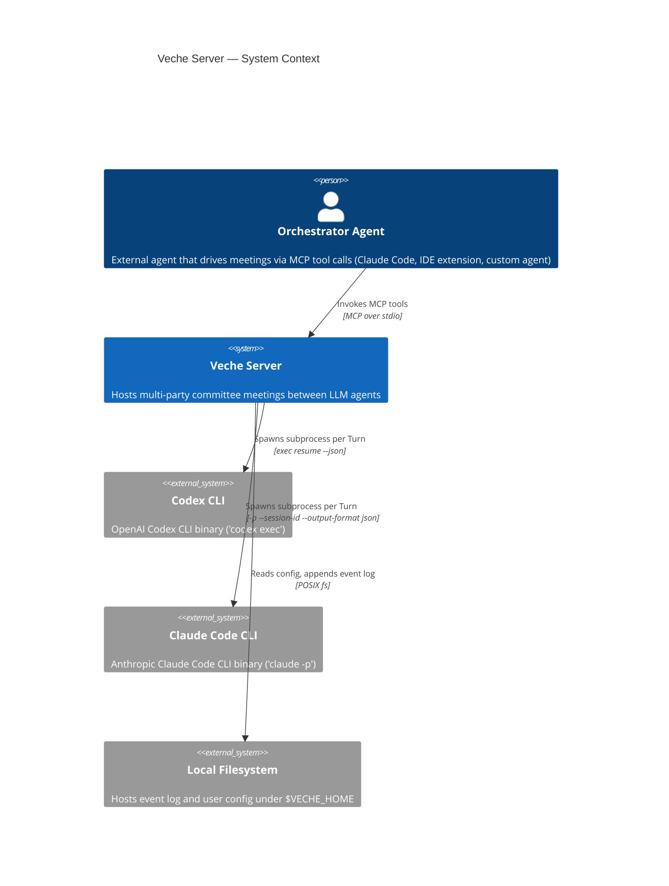
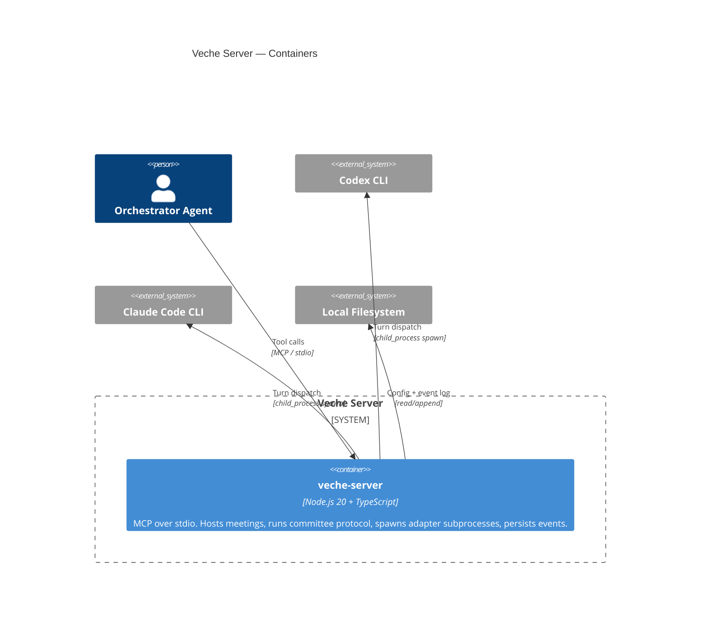
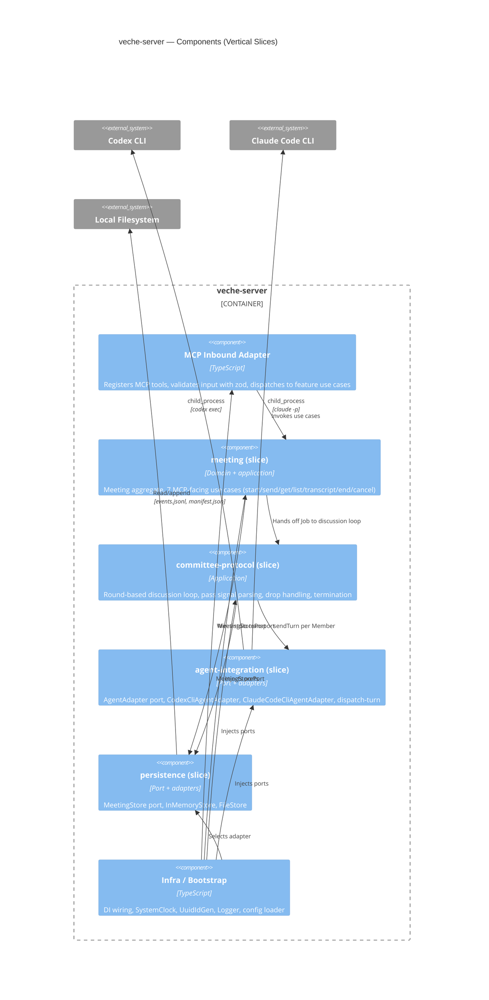
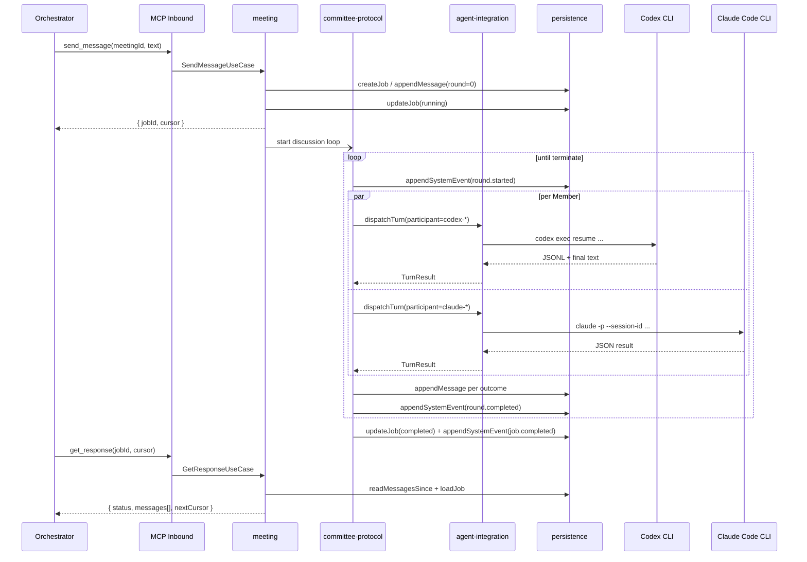

# C4 Model — Veche Server

Three diagrams describe the system at the Context, Container, and Component levels.

## Level 1 — Context

## Level 2 — Container

## Level 3 — Component (veche-server)

## Cross-component sequence — `send_message` → Committee → `get_response`

The following sequence complements the component diagram by showing the temporal flow across components for the headline happy path.

