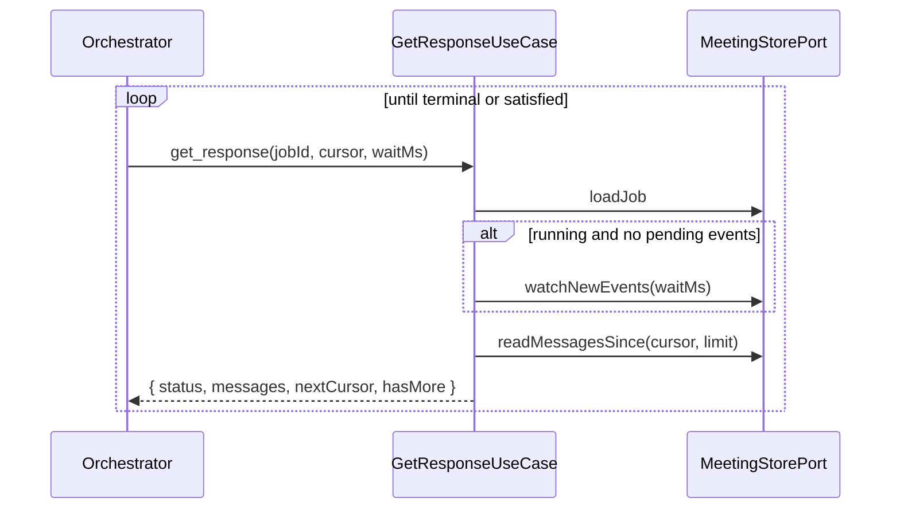

# Use Case: get-response

## Actor

Orchestrator Agent calling MCP tool `get_response`.

## Input

| Field | Type | Validation |
|-------|------|------------|
| `jobId` | `JobId` | Required. Must reference an existing Job. |
| `cursor` | string | Optional. Opaque. When absent, the server returns events from the Job's creation onward. When present, must be a valid Cursor for the Job's Meeting. |
| `limit` | integer | Optional. 1–500. Default `200`. Maximum number of Messages returned in this call. |
| `waitMs` | integer | Optional. 0–60 000. Default `0`. When greater than zero, the server may block up to this many milliseconds waiting for new events before responding, reducing polling overhead. |

## Output

**Success:**

```
{
  jobId: JobId,
  meetingId: MeetingId,
  status: 'queued' | 'running' | 'waiting_for_human' | 'completed' | 'failed' | 'cancelled',
  terminationReason: 'all-passed' | 'max-rounds' | 'no-active-members' | 'cancelled' | null,
  error: { code: string, message: string } | null,
  messages: {
    id: MessageId,
    seq: integer,
    round: integer,
    author: ParticipantId | 'system',
    kind: 'speech' | 'pass' | 'system',
    text: string,
    createdAt: Instant
  }[],
  humanTurn: null | {
    requestId: string,
    round: integer,
    participant: { id: ParticipantId, displayName: string, discussionRole: DiscussionRole },
    agreeTargets: { id: ParticipantId, displayName: string, discussionRole: DiscussionRole }[],
    strengths: [1, 2, 3],
    canSkip: true,
    canSteer: true
  },
  synthesis: null | { jobId: JobId, text: string, createdAt: Instant },
  nextCursor: Cursor,
  hasMore: boolean
}
```

**Failure:** See *Errors*.

## Flow

1. Validate Input.
2. `MeetingStorePort.loadJob(jobId)`. If absent → `JobNotFound`.
3. Resolve `meetingId` from the Job.
4. If `waitMs > 0` and the Job is `queued` or `running` and there are no events beyond `cursor` (quick pre-check via `readMessagesSince(meetingId, cursor, limit=1)`): wait on the store's change-notification primitive for up to `waitMs` or until an event lands, whichever comes first. `waiting_for_human` Jobs return immediately so callers can surface the pending `humanTurn`.
5. Read the next page: `MeetingStorePort.readMessagesSince({ meetingId, cursor, limit })`.
6. Load the Job again if `status` may have advanced since step 2. Return the latest `JobSnapshot` along with the page.
7. Compose the success payload:
   - `status` and `terminationReason` come from the Job.
   - `error` comes from the Job (`null` unless `status = failed`).
   - `messages` contains `speech`, `pass`, and `system` Messages from the page. Other event types (e.g. `round.started`) are **not** surfaced through this tool — they remain in the store's event log for observability but are not part of the public contract.
   - `humanTurn` is non-null only when the latest Human Turn request for this Job has no accepted submission and the Human Participant remains enabled.
   - `synthesis` is non-null after `submit_synthesis` stores a final result for this Job.
   - `nextCursor` = page's `nextCursor`; `hasMore` = page's `hasMore`.

## Errors

| Error | When | MCP code |
|-------|------|----------|
| `InvalidInput` | Schema violation. | `invalid_params` |
| `JobNotFound` | `jobId` unknown. | `not_found` |
| `CursorInvalid` | Cursor fails to decode or points outside the Meeting's log. | `invalid_params` |
| `StoreUnavailable` | Store error. | `internal_error` |

## Side Effects

None.

## Rules

- **Idempotent.** Multiple `get_response` calls with the same cursor return the same events. Advancing the Cursor is the caller's responsibility — they echo `nextCursor` back.
- **No events filter.** Round-markers (`round.started`, `round.completed`) are retained in the event log but are not returned here. Callers wanting the raw log use [get-transcript](./get-transcript.usecase.md), which also only returns Messages; the raw event log is an internal contract.
- **Wait-free for terminal Jobs.** When `status` is `completed`, `failed`, or `cancelled`, `waitMs` is ignored — the call returns immediately.
- **Page size ≤ `limit`.** When the store has more than `limit` pending Messages, `hasMore = true` and the caller paginates by re-issuing `get_response` with `nextCursor`.
- **No duplicates.** A Message is assigned `seq` exactly once at append time; delivery is deduplicated by `seq`.
- **Terminal snapshot.** When `status = completed`, the final `round.completed` → `job.completed` sequence has already been persisted; the last `get_response` page therefore contains every Message up to termination, and a subsequent call returns an empty `messages` array with `hasMore = false`.

## Sequence


