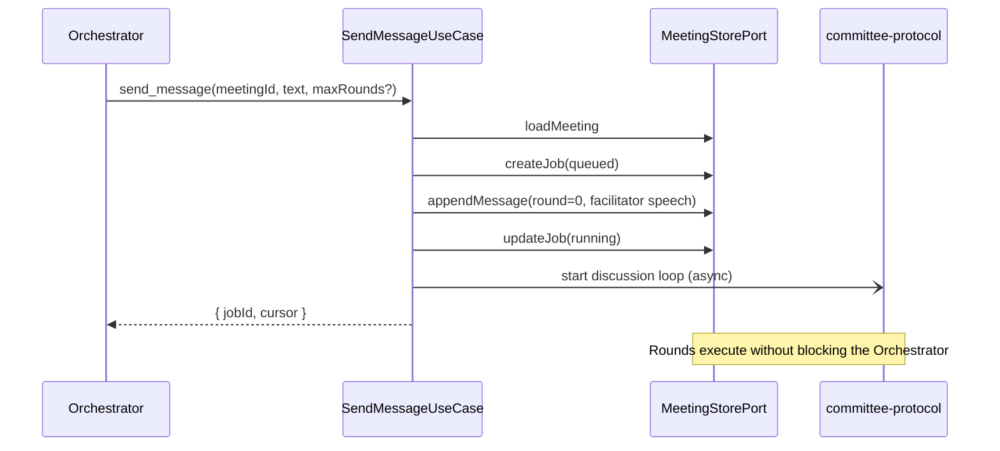

# Use Case: send-message

## Actor

Orchestrator Agent calling MCP tool `send_message`.

## Input

| Field | Type | Validation |
|-------|------|------------|
| `meetingId` | `MeetingId` | Required. Must reference an `active` Meeting. |
| `text` | string | Required. 1–32 KiB after trim. UTF-8. |
| `maxRounds` | integer | Optional. 1–`VECHE_MAX_ROUNDS_CAP`. Default is the Meeting's `defaultMaxRounds`. |
| `turnTimeoutMs` | integer | Optional. 10 000–3 600 000. Default `300000` (5 min). Applies per Member Turn. |
| `addressees` | `ParticipantId[]` | Optional. Subset of non-dropped Members. Default = all non-dropped Members. |

## Output

**Success:**

```
{
  jobId: JobId,
  meetingId: MeetingId,
  cursor: Cursor            // points at the Facilitator Message seq (Round 0); the Orchestrator passes this to get_response to receive the full Job output
}
```

**Failure:** See *Errors*.

## Flow

1. Validate Input. Normalise `text` by trimming leading/trailing whitespace; reject if empty post-trim.
2. `MeetingStorePort.loadMeeting(meetingId)`.
   - 2a. If not found → `MeetingNotFound`.
   - 2b. If `status = ended` → `MeetingAlreadyEnded`.
3. Verify at least one Member in `addressees` is `active`. If the Meeting has an effective active-Member set of size 0, fail with `NoActiveMembers`.
4. Verify no other Job for this Meeting has `status ∈ { queued, running }`. If so, fail with `MeetingBusy`.
5. Create a new `Job` with: fresh `JobId`, `status = queued`, `maxRounds` from input (or Meeting default), `lastSeq = -1`. Persist via `MeetingStorePort.createJob`.
6. Build the Facilitator Message: `author = facilitator.id`, `kind = speech`, `round = 0`, `text = normalized text`. Persist via `MeetingStorePort.appendMessage`. The returned `seq` becomes the `cursor` handed back to the caller.
7. Mark Job `running` via `MeetingStorePort.updateJob({ status: running, startedAt: Clock.now })`. Emit `job.started`.
8. Hand the Job off to the committee-protocol feature (fire-and-forget async task inside the server process): the discussion loop runs via [run-round](../committee-protocol/run-round.usecase.md) until [terminate-discussion](../committee-protocol/terminate-discussion.usecase.md) fires.
9. Return `{ jobId, meetingId, cursor }`. The Orchestrator calls [get-response](./get-response.usecase.md) with this `cursor` to consume Transcript deltas.

## Errors

| Error | When | MCP code |
|-------|------|----------|
| `InvalidInput` | Schema violation. | `invalid_params` |
| `MeetingNotFound` | `meetingId` does not exist. | `not_found` |
| `MeetingAlreadyEnded` | Meeting `status = ended`. | `failed_precondition` |
| `NoActiveMembers` | Every Member is `dropped` or `addressees` filters to zero. | `failed_precondition` |
| `MeetingBusy` | Another Job is queued or running for this Meeting. | `failed_precondition` |
| `AddresseeNotFound` | `addressees` contains an id that is not a Member of the Meeting. | `invalid_params` |
| `StoreUnavailable` | `MeetingStorePort` raised a non-domain error. | `internal_error` |

## Side Effects

- New Job record appended (`job.started`).
- Facilitator Message appended (`message.posted` at Round 0).
- Asynchronous discussion started. Subsequent Events land on the Meeting log as the Rounds execute.

## Rules

- `send_message` is **non-blocking from the MCP point of view**. The tool response must return within the MCP transport's tool-call SLA regardless of how long the discussion takes. The only blocking work is the validation, Job creation, Facilitator Message append, and Job state transition to `running`.
- **One Job at a time per Meeting.** The `MeetingBusy` check is the only contention point; it is validated and enforced by the store (a `createJob` on a busy Meeting fails with `JobStateTransitionInvalid` and is surfaced as `MeetingBusy`).
- **`addressees` never widens.** It can only narrow the default set. Members not listed stay `active` but are skipped for this Job only; they may participate in later Jobs.
- **The returned `cursor` points at Round 0.** The caller's first `get_response` therefore receives the Facilitator Message followed by all Round 1..N events as they arrive.
- **Round execution is detached.** If the MCP server process terminates while a Job is running, the Job is eligible for recovery: the `FileStore` retains the `job.started` event without a terminal match. Recovery policy is out of scope for v1; such Jobs are classified `failed` on next startup with error code `InterruptedByShutdown` (see [run-round](../committee-protocol/run-round.usecase.md) for how shutdown is observed).
- **`turnTimeoutMs` caps each *Turn*, not the full Job.** Total wall-clock for the Job is bounded by `maxRounds × turnTimeoutMs + constant overhead`.

## Sequence


