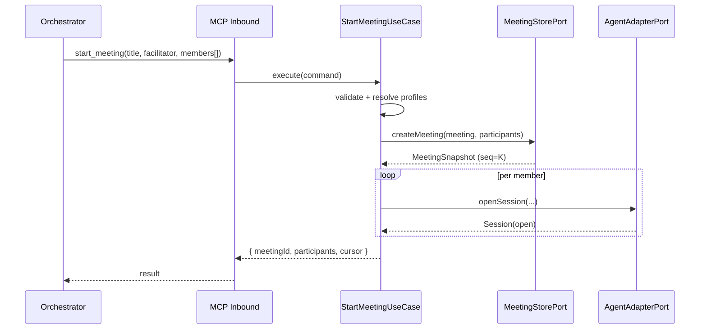

# Use Case: start-meeting

## Actor

Orchestrator Agent calling MCP tool `start_meeting`.

## Input

| Field | Type | Validation |
|-------|------|------------|
| `title` | string | Required. 1–200 chars after trim. |
| `facilitator` | object | Required. Describes the Orchestrator's Participant. |
| `facilitator.id` | string | Optional. Default `"facilitator"`. Must match `^[a-zA-Z0-9][a-zA-Z0-9_.-]{0,63}$`. Unique within the Meeting. |
| `facilitator.displayName` | string | Optional. 1–64 chars. Used in `transcriptPrefix` preambles. |
| `members` | object[] | Required. 1–8 entries. Each entry describes a Member. |
| `members[].id` | string | Required. Matches the id regex. Unique across all Participants in this call. |
| `members[].profile` | string | Optional. Must refer to a Profile present in the user config file. |
| `members[].adapter` | `codex-cli` \| `claude-code-cli` | Required when `profile` is absent; ignored when `profile` is present and already names an adapter (must match if both supplied). |
| `members[].model` | string | Optional override. Empty string is rejected. |
| `members[].systemPrompt` | string | Optional override. Max 8 KiB. |
| `members[].workdir` | string | Optional. Must be an absolute existing directory readable by the server process. |
| `members[].extraFlags` | string[] | Optional. Each flag must be in the adapter's allow-list ([codex-cli-adapter](../agent-integration/codex-cli-adapter.usecase.md), [claude-code-cli-adapter](../agent-integration/claude-code-cli-adapter.usecase.md)). Max 16 entries. |
| `members[].env` | `Record<string,string>` | Optional. Keys match `^[A-Z_][A-Z0-9_]*$`. Forbidden keys: `CODEX_API_KEY`, `HOME`, `PATH`, `CLAUDE_BIN`, `CODEX_BIN`. Max 32 entries. |
| `defaultMaxRounds` | integer | Optional. 1–`VECHE_MAX_ROUNDS_CAP`. Default `8`. |

## Output

**Success:**

```
{
  meetingId: MeetingId,
  title: string,
  createdAt: Instant,
  participants: {
    id: ParticipantId,
    role: 'facilitator' | 'member',
    adapter: 'codex-cli' | 'claude-code-cli' | null,
    profile: string | null,
    model: string | null
  }[],
  defaultMaxRounds: integer,
  cursor: Cursor          // points past the meeting.created event; first useful starting point for get_transcript
}
```

**Failure:** See *Errors* below.

## Flow

1. Validate Input against the schema above. Reject on first violation.
2. For each Member entry:
   - 2a. If `profile` is present, load it from the user config file. Merge: Profile fields are defaults; the Member's own fields override. Require that the resulting `adapter` is defined.
   - 2b. Verify the Adapter reports `capabilities.supportsWorkdir` when `workdir` is set, and `capabilities.supportsSystemPrompt` when `systemPrompt` is set. On mismatch emit `AdapterConfigInvalid`.
   - 2c. Verify every `extraFlags` entry is allow-listed for the resolved `adapter`.
3. Build the `Meeting` aggregate with status `active`, a new `MeetingId` from `IdGen`, and the current `Instant` from `Clock`.
4. For each Participant (Facilitator first), assemble a Participant record. The Facilitator has `adapter = null` and no Session.
5. Call `MeetingStorePort.createMeeting`. The store emits `meeting.created` at `seq = 0` and `participant.joined` at `seq = 1..K`.
6. For each Member, call `AgentAdapterPort.openSession` with `sessionId` from `IdGen.newParticipantSessionId`. The Adapter records the Session; the Meeting records `{ sessionId, providerRef: null }` on the Participant (providerRef updated on first Turn).
   - 6a. If `openSession` throws `AdapterNotAvailable` or `AdapterConfigInvalid`, the whole `start_meeting` call fails — previously created Sessions are closed with `closeSession`; the Meeting is rolled back via `MeetingStorePort.endMeeting` followed by a record of the reason (`meeting.ended` with a `startup-failed` marker). The Orchestrator sees the error response; no partial Meeting remains visible to subsequent `list_meetings` calls.
7. Return the success payload with the Cursor pointing past the last Participant-join event.

## Errors

| Error | When | MCP code |
|-------|------|----------|
| `InvalidInput` | Schema violation (field missing, wrong type, out of range, forbidden env key). | `invalid_params` |
| `ProfileNotFound` | `members[].profile` does not match any Profile in the user config file. | `invalid_params` |
| `ProfileAdapterMismatch` | `members[].profile` and `members[].adapter` disagree. | `invalid_params` |
| `DuplicateParticipantId` | Two Participants share `id` (including Facilitator). | `invalid_params` |
| `WorkdirUnavailable` | `workdir` is not absolute, not existing, or not readable. | `invalid_params` |
| `AdapterFlagNotAllowed` | `extraFlags` contains an entry outside the adapter's allow-list. | `invalid_params` |
| `AdapterNotAvailable` | Adapter binary missing or credentials absent (bubbled from `openSession`). | `unavailable` |
| `AdapterConfigInvalid` | Adapter rejects a resolved Participant configuration. | `invalid_params` |
| `StoreUnavailable` | `MeetingStorePort` raised a non-domain error (e.g. disk full for `FileStore`). | `internal_error` |

## Side Effects

- New Meeting and Participant events appended to `MeetingStorePort`.
- One Session per Member created via `AgentAdapterPort.openSession`.
- On startup failure, partial Sessions are closed and the Meeting is marked `ended` with reason `startup-failed`; this terminal Meeting remains visible in the event log but is excluded from the `list_meetings` default filter (`status=active`).

## Rules

- A Meeting has exactly one Facilitator and at least one Member.
- A Participant's resolved `adapter` must belong to the v1 set (`codex-cli` | `claude-code-cli`).
- `defaultMaxRounds` is clamped to `[1, VECHE_MAX_ROUNDS_CAP]`; a value outside the range is treated as `InvalidInput`, never silently clamped.
- `systemPrompt` is the *user* portion; the Pass Signal instruction (`<PASS/>` protocol) is appended by [dispatch-turn](../agent-integration/dispatch-turn.usecase.md). Callers do not need to include it.
- The Facilitator's `displayName` defaults to its `id` when omitted.
- `start_meeting` is synchronous — it completes before returning control to the Orchestrator. No Job is started.

## Sequence


